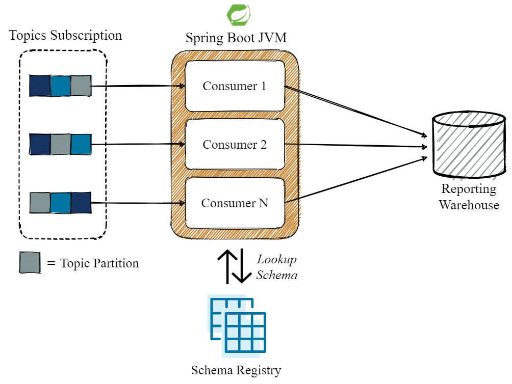

# Testing Transient Errors in a Multi-Threaded Kafka Processor

See this [repo](https://github.com/AlexeiZenin/sb-generic-protobuf) for context on the processor 
shown in this example. The codebase is a direct extension of the repo linked.

## Overview

The repository seeks to demonstrate the usage of the 
[error handling strategies](https://docs.spring.io/spring-kafka/reference/html/#error-handlers) 
that Spring Kafka exposes to the developer and how to test your configurations in a concurrent environment.

We leverage the standard exposed configuration from the Spring Kafka library to vertically scale our
Kafka consumers running in the same JVM:

```yaml
spring:
  kafka:
    listener:
      concurrency: 3
```

The subsequent system that is materialised is shown below.



### Try it out (requires Docker)

The following commands will run a test which will:

-  Setup a Kafka docker container for the test
-  Configure Spring Boot to instantiate _**X**_ Kafka Consumers managed by Spring Kafka 
(_**X**_ threads each separately invoking `poll()` on their Kafka Consumer instance)
-  Setup our `ReportingWarehouseSender` to fail transiently several times with a fake `HTTP 503` exception.
-  Once the configured number of transient errors are reached, successfully process the record by throwing no
exceptions
-  Confirm our backoff logic works and that the `SeekToCurrentErrorHandler` is setup correctly to redeliver
failed messages during processing

The successful messages that are processed will show up as these lines in the logs, where _**X**_ is the thread
number (e.g. 0, 1, 2):

```shell script
[ntainer#0-{X}-C-1] c.zenin.genericproto.TransientErrorTest  : Success in sending to warehouse
```

The transient errors should also be logged to the console:

```shell script
[ntainer#0-{X}-C-1] essageListenerContainer$ListenerConsumer : Error handler threw an exception
```

#### Run with concurrency set to 1
```shell script
Linux: ./mvnw -Dtest=TransientErrorTest -Dspring.kafka.listener.concurrency=1 clean test
Windows: mvnw.cmd -Dtest=TransientErrorTest -Dspring.kafka.listener.concurrency=1 clean test
```

You should see 3 stacktraces coming from 1 thread, with all the records successfully printed to the screen
at the end of the test.

#### Run with concurrency set to 3
```shell script
Linux: ./mvnw -Dtest=TransientErrorTest -Dspring.kafka.listener.concurrency=3 clean test
Windows: mvnw.cmd -Dtest=TransientErrorTest -Dspring.kafka.listener.concurrency=3 clean test
```

You should see 9 stacktraces coming from 3 threads (3 per thread), 
with each thread printing exactly 1 successfully processed record (3 in total).

